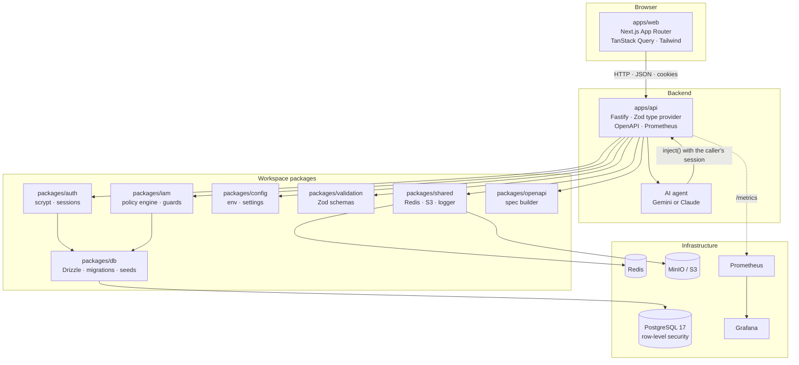
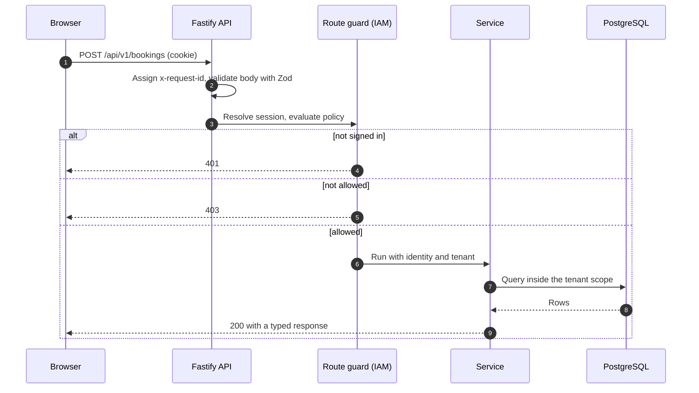
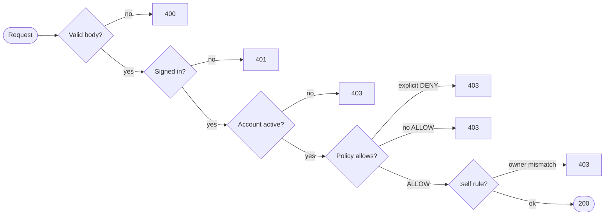

<div align="center">


# Baseline

### Run your whole sports club from one place.

Court bookings, memberships, the shop and bar, staff and reporting, with an AI assistant that works inside the permissions of whoever is signed in.

<p>
  
  
  
  
  
  
  
  
  
  
  
</p>

[Quick start](#-quick-start) · [Features](#-features) · [Architecture](#-architecture) · [Tech stack](#-tech-stack) · [Security](#-security-model) · [Testing](#-testing) · [Deploying](#-before-deploying)

</div>

---

## Overview

Baseline is a multi-tenant management system for sports clubs. Members and walk-ins book courts online. Staff run the front desk, the shop, the bar and the kitchen from one workspace. Owners see revenue, occupancy and what needs attention as it happens.

It is a **pnpm monorepo**: a Next.js web app, a Fastify API, and a set of small packages that own authentication, authorization, the database, configuration and validation. The frontend never touches the database. The backend owns every security decision.

<table>
<tr>
<td width="50%"></td>
<td width="50%"></td>
</tr>
</table>

---

## Features

| | Area | What it does |
| :-: | :-- | :-- |
| 📅 | **Courts and bookings** | Live availability grid, member pricing, social sessions, cancellations, refunds, printable receipts. Double bookings are ruled out in the database. |
| 🪪 | **Memberships** | Plans, renewals, expiry reminders, check-ins and a full event history per member. |
| 🛒 | **Shop and counter sales** | Point of sale with stock that counts down as you sell, order tracking and a public shop. |
| 🍹 | **Bar and kitchen** | Floor map with open tabs, kitchen tickets, menu management and takings. |
| 👥 | **Front desk and CRM** | Member search, lead pipeline from first enquiry to signed member, invoices. |
| 🧑‍💼 | **Staff** | Employees, shifts and clock-in, leave requests, shift swaps and payroll. |
| 📊 | **Reports** | Revenue by day, source and payment mode, occupancy, and a live owner dashboard. |
| 🤖 | **AI assistant** | Ask questions in plain words. Reads run at once; changes wait for your approval. |
| 🌐 | **Your own site** | A public club page with your logo, colours and court times, on your own domain. |
| 🔐 | **Identity and access** | Roles, groups, policies and permissions with explicit deny, plus self-service rules. |

---

## Architecture



### Request lifecycle



### Monorepo layout

```text
baseline/
├── apps/
│   ├── web/                 Next.js app: marketing site, auth, signed-in workspace
│   └── api/                 Fastify gateway: routes, services, agent, plugins
├── packages/
│   ├── auth/                Password hashing, timing-safe checks, session manager
│   ├── iam/                 Permission catalog, PolicyEngine, IamService, guards
│   ├── db/                  Drizzle schema, migrations, deterministic seeds
│   ├── config/              getEnv(), app, auth and IAM configuration
│   ├── validation/          Shared Zod schemas and HTTP error shapes
│   ├── shared/              Redis, S3 storage, structured logger, crypto
│   └── openapi/             OpenAPI 3.0 builder and security schemes
├── tests/                   Vitest suites, mirroring apps/ and packages/
├── skills/                  Agent Skills: portable guides for each subsystem
├── infrastructure/          Prometheus and Grafana configuration
├── scripts/                 Setup, health check and tooling
└── docker-compose.yml       PostgreSQL, Redis, MinIO, Prometheus, Grafana
```

### Layering rules

1. `apps/web` talks only to `apps/api`. It never sees database, Redis or storage credentials.
2. `packages/*` never import from `apps/*`, and there are no circular dependencies between packages.
3. All configuration comes from `getEnv()` in `packages/config`. Nothing is hard-coded.
4. Every external input is validated with Zod at the API boundary.
5. Storage goes through the `StorageService` abstraction, never MinIO-specific calls.

---

## Tech stack

| Layer | Technology |
| :-- | :-- |
| **Frontend** | Next.js 16 (App Router), React 19, Tailwind CSS 3, Radix primitives, TanStack Query 5, lucide-react, Sonner |
| **Backend** | Fastify 5, Zod type provider, Swagger / OpenAPI, structured logging with Pino |
| **Database** | PostgreSQL 17, Drizzle ORM, SQL migrations, row-level security per tenant |
| **Cache and queues** | Redis (ioredis) |
| **Object storage** | S3-compatible: MinIO locally, any S3 in production |
| **Auth** | Node `scrypt`, SHA-256 hashed server-side sessions, HTTP-only cookies |
| **AI** | Gemini or Claude over plain `fetch`, behind a small `LlmClient` interface |
| **Observability** | Prometheus metrics, Grafana dashboards, request correlation ids |
| **Quality** | TypeScript 5.7, Vitest 3 with v8 coverage, ESLint, pnpm workspaces |

---

## Quick start

### Prerequisites

* **Node.js** `>=22.13.0`
* **pnpm** `>=11.1.0`
* **Docker** with Compose v2

### Run it

```bash
# 1. Install dependencies
pnpm install

# 2. Start PostgreSQL, Redis, MinIO, Prometheus and Grafana
pnpm infra:up

# 3. Create the schema and seed baseline IAM plus demo data
pnpm db:migrate
pnpm db:seed

# 4. Optional: load 300 members, 10 courts, bookings and payments
pnpm db:seed:bulk

# 5. Start the web app and the API
pnpm dev
```

Your root account credentials were generated during scaffolding and written to `.env` as `INITIAL_ROOT_EMAIL` and `INITIAL_ROOT_PASSWORD`. `pnpm db:seed` uses them to create the ROOT identity.

For a faster demo with no compile waits, build once and serve the production build:

```bash
pnpm build
pnpm --filter @app/web start
```

### Local endpoints

| Service | URL |
| :-- | :-- |
| Web app | http://localhost:3000 |
| API | http://localhost:3001 |
| OpenAPI docs | http://localhost:3001/api/docs |
| Metrics | http://localhost:3001/metrics |
| Grafana | http://localhost:3002 |
| MinIO console | http://localhost:9001 |

### Demo accounts

The seed creates one account per role, all sharing `SEED_DEMO_PASSWORD` from `.env`.

| Role | Email |
| :-- | :-- |
| Owner | `owner@courtos.test` |
| Front desk | `desk@courtos.test` |
| Bar | `bar@courtos.test` |
| Member | `member@courtos.test` |

The bulk seed adds `bulk.user0001@baseline.test` through `bulk.user0300@baseline.test` (members, a mix of active, suspended and disabled).

---

## Security model



* `ROOT` has unconditional administrative authority.
* An explicit `DENY` always beats an `ALLOW`.
* `:self` permissions require `resourceOwnerId` to equal the caller's id.
* Suspended and disabled accounts are refused every authenticated call.
* Passwords are hashed with `scrypt`. Session tokens are stored only as SHA-256 hashes.
* Every error returns a sanitized body with a `requestId`. Stack traces never reach clients, and passwords, tokens and connection strings are never logged.

### AI assistant

The assistant acts as the signed-in user. It calls the API through `fastify.inject()` with that user's own session, so every route guard applies and it can never do more than they can.

* **Reads** (courts, bookings, members, leads, reports) run immediately.
* **Writes** (cancel a booking, create a lead, change a name) are staged as pending actions that you confirm or reject.
* Access is controlled by the `agent:use` and `agent:act` permissions.

Set one key in `.env` to switch it on:

```bash
GEMINI_API_KEY=...        # uses gemini-2.5-flash (override with GEMINI_MODEL)
# or
ANTHROPIC_API_KEY=...     # takes precedence when both are set (AGENT_MODEL, AGENT_MAX_TOOL_STEPS)
```

See [`skills/agent/SKILL.md`](skills/agent/SKILL.md) for the design.

---

## Configuration

Settings live in `packages/config/src/` and are read only through `getEnv()`.

| File | Holds |
| :-- | :-- |
| `app-config.ts` | Application constants and metadata |
| `auth-config.ts` | Registration, session lifetime, cookie name |
| `iam-config.ts` | Declarative roles, groups, default policies |
| `feature-config.ts` | Toggles for email, realtime, storage, observability, agent |
| `env.ts` | Zod parsing of every environment variable |

---

## Testing

All tests live under [`tests/`](tests), mirroring the layout of `apps/` and `packages/`.

```bash
pnpm test              # Vitest across the whole workspace
pnpm test:coverage     # With v8 coverage and enforced thresholds
pnpm test:security     # Adversarial and authorization suites
pnpm typecheck         # TypeScript across every package
pnpm lint
pnpm verify            # The full local quality gate
```

Suites that need PostgreSQL skip themselves when no database is reachable. To run them, point `DATABASE_URL` and the Redis variables at a disposable database, migrate and seed it, then run the API tests.

Repository rules: every new behavior has a test, every bug fix gets a regression test, and every API route is exercised with `app.inject()` for validation (400), authentication (401), authorization (403) and success shapes.

---

## Scripts

| Command | Description |
| :-- | :-- |
| `pnpm dev` | Web and API together |
| `pnpm dev:api` / `pnpm dev:web` | One app on its own |
| `pnpm build` | Compile every package and app |
| `pnpm db:migrate` | Apply Drizzle migrations |
| `pnpm db:seed` | Baseline IAM, ROOT account and demo data |
| `pnpm db:seed:bulk` | 300 members, 10 courts, bookings and payments |
| `pnpm db:studio` | Drizzle database GUI |
| `pnpm infra:up` / `infra:down` / `infra:reset` | Manage the Docker services |
| `pnpm health` | End-to-end infrastructure check |
| `pnpm skills:check` | Validate the Agent Skills registry |

### Bulk demo data

`pnpm db:seed:bulk` needs `BULK_SEED_PASSWORD` or `SEED_DEMO_PASSWORD`. It loads 300 member logins with mixed statuses, 10 courts, membership history, and thousands of bookings with payments across the past 60 and next 14 days. It is deterministic and safe to run again.

---

## Object storage

Local storage uses `ghcr.io/coollabsio/minio:latest`, a community build of MinIO that includes the `mc` client, because the official `minio/minio` and `minio/mc` images are no longer publicly pullable. The `minio-init` service creates the configured bucket and stays up with a health check, so `docker compose up -d --wait` confirms storage is ready.

```bash
docker compose pull minio minio-init
docker compose up -d --wait
```

An opt-in regression test builds a disposable Docker network and volume, exercises initialization, bad credentials and S3 operations, then cleans up:

```bash
RUN_STORAGE_SMOKE=true pnpm test tests/packages/shared/storage/minio-compose.test.ts
```

---

## Before deploying

`.env` is generated with a unique `SESSION_SECRET` and root password, but the infrastructure credentials are development defaults. The API refuses to start with `NODE_ENV=production` while any remain, and lists exactly what to change.

- [ ] Replace `DATABASE_PASSWORD`, `S3_ACCESS_KEY`, `S3_SECRET_KEY`, and set `REDIS_PASSWORD`.
- [ ] Set `TRUST_PROXY` when running behind nginx, a load balancer or Docker ingress, otherwise per-IP rate limiting is disabled.
- [ ] Set `NEXT_PUBLIC_API_URL` to the API origin the browser can reach.
- [ ] Keep `BIND_ADDRESS` on `127.0.0.1` unless you mean to expose the services.
- [ ] Rotate any API key that has been pasted into chat, tickets or logs.

---

## Agent Skills

Portable guides for each subsystem live in [`skills/`](skills), with a machine-readable registry in [`skills/index.yaml`](skills/index.yaml). They cover architecture, authentication, authorization, database, API, frontend, design, security, validation, testing, storage, email, realtime, observability, dependencies and the agent. [`AGENTS.md`](AGENTS.md) is the operating manual for contributors and coding agents.

---

## License

[MIT](LICENSE) © 2026 Rabari Mihir
