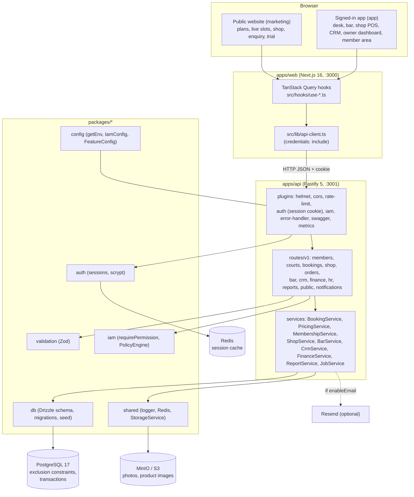
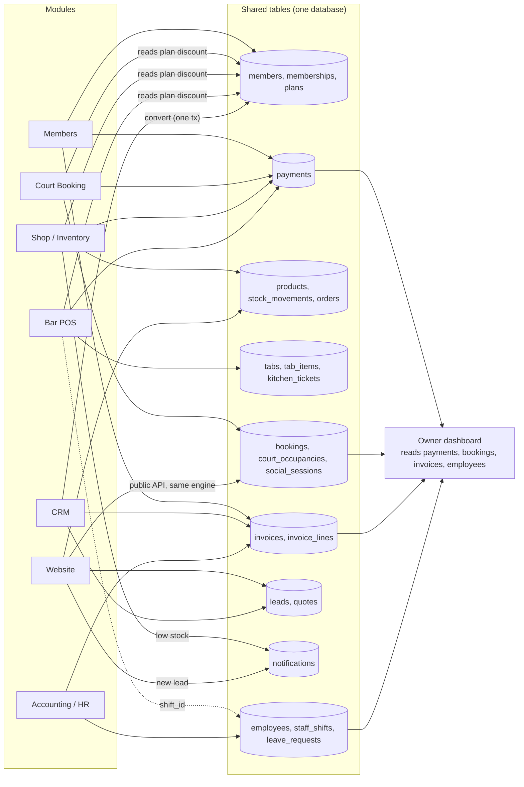
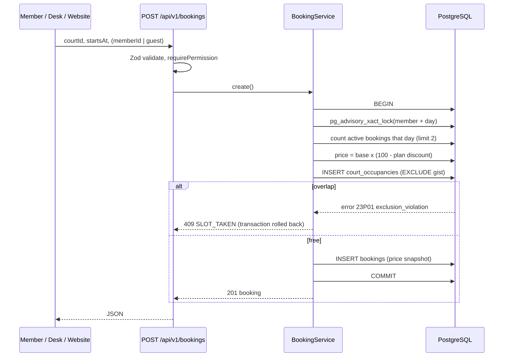
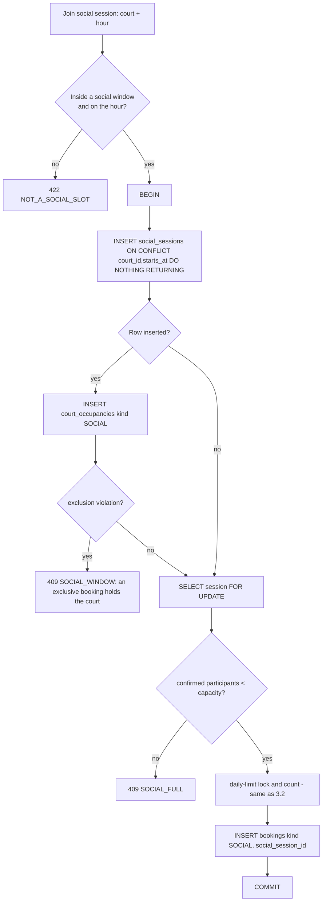
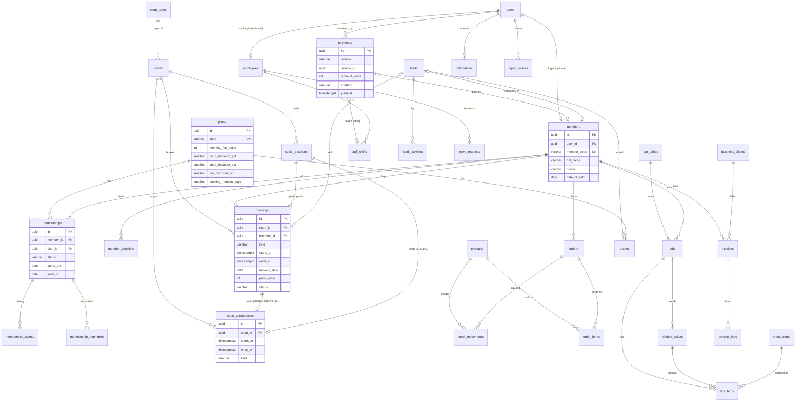

# ARCHITECTURE_AND_DATABASE.md

> Built on the repo as it is: Next.js 16 (`apps/web`) → Fastify 5 (`apps/api`) → `packages/*` → PostgreSQL 17 / Redis / MinIO, with Drizzle ORM 0.45.
> Existing tables are **extended, never rewritten**. Section 6 lists what is existing and what is new.

---

## 1. System architecture



Layering rules from `AGENTS.md` stay intact: the web app never touches Postgres, Redis or MinIO; `packages/*` never import `apps/*`; the API reads config only through `getEnv()`.

**Where logic lives:** routes only validate (Zod), authorise (`requirePermission`) and call a service. **All rules in PROJECT_OVERVIEW.md section 6 live in services** (`apps/api/src/services/*.service.ts`), so they can be unit-tested without HTTP and reused by the public routes.

### Module interaction: everything writes into shared tables



### Booking request flow



---

## 2. Time, money, ids (conventions for the whole schema)

- **Money:** `integer` paise (`price_paise`, `amount_paise`). Never floats. Sum in SQL with `::bigint`.
- **Instants:** `timestamp with time zone`. **Business days:** `date` columns hold the **club-local** date (for example `bookings.booking_date`) so "per day" queries use a plain index and never recompute time zones. Computed in the service with `CLUB_TIMEZONE` (PROPOSED ADDITION to env).
- **Ids:** `uuid` default random, matching `users`. Human codes (`CC-000123`, `INV-2026-0001`, `ORD-000123`) come from PostgreSQL **sequences**.
- **Enums:** `varchar` + `$type<…>()` + a SQL `CHECK`, not Postgres enums, matching `auth.ts`.
- **Percentages:** `smallint` 0–100 with `CHECK`.

---

## 3. How the hard rules are enforced

### 3.1 No double booking (BR-03): the database guarantees it

Application code can race (two requests both read "free" and both insert). So the guarantee is a **PostgreSQL exclusion constraint** on a dedicated occupancy table:

```sql
CREATE EXTENSION IF NOT EXISTS btree_gist;

ALTER TABLE court_occupancies
  ADD CONSTRAINT court_occupancies_no_overlap
  EXCLUDE USING gist (
    court_id WITH =,
    tstzrange(starts_at, ends_at, '[)') WITH &&
  );
```

- `'[)'` is half-open: 18:00–19:00 and 19:00–20:00 do **not** collide; 18:00–19:00 and 18:30–19:30 do.
- **Why a separate table:** a standard booking, a social session and a maintenance block must all be unable to overlap each other. An exclusion constraint cannot span tables, so all three write one row to `court_occupancies`. That table is the single source of truth for "is this court busy".
- Cancelling deletes the occupancy row (the `bookings` row stays as CANCELLED for history).
- Shape rules are in the database too, so a buggy client cannot sneak in a 45-minute booking:

```sql
ALTER TABLE court_occupancies ADD CONSTRAINT court_occupancies_shape CHECK (
  ends_at > starts_at AND (
    (kind = 'BOOKING'
       AND ends_at - starts_at = interval '1 hour'
       AND extract(minute FROM (starts_at AT TIME ZONE 'UTC')) IN (0, 30)
       AND extract(second FROM (starts_at AT TIME ZONE 'UTC')) = 0)
    OR (kind = 'SOCIAL'
       AND ends_at - starts_at = interval '1 hour'
       AND extract(minute FROM (starts_at AT TIME ZONE 'UTC')) = 30
       AND extract(second FROM (starts_at AT TIME ZONE 'UTC')) = 0)
    OR kind = 'MAINTENANCE'
  )
);
```

(India's UTC offset is +05:30, so a BOOKING start on local `:00`/`:30` is UTC `:30`/`:00`, and the allowed set `{0, 30}` is the same either way. SOCIAL sessions must start on the **local** hour, which is UTC minute **30**: Friday 18:00 IST = 12:30 UTC. If `CLUB_TIMEZONE` changes to an offset with other minutes, add a migration that rewrites this check (migration 0004 is the current version).)

- **Same person in two places:** a second exclusion constraint on `bookings` stops one member holding overlapping sessions on different courts:

```sql
ALTER TABLE bookings ADD CONSTRAINT bookings_member_no_overlap
  EXCLUDE USING gist (member_id WITH =, tstzrange(starts_at, ends_at, '[)') WITH &&)
  WHERE (member_id IS NOT NULL AND status IN ('CONFIRMED','COMPLETED','NO_SHOW'));
```

- **Handling the error.** Postgres reports `23P01` (exclusion_violation). The service maps it to `409 SLOT_TAKEN` (or `409 MEMBER_DOUBLE_BOOKED` when the violated constraint name is `bookings_member_no_overlap`). Two practical points:
  1. A failed statement aborts the whole transaction, so **catch outside `db.transaction(...)`**, not inside.
  2. Drizzle 0.45 may wrap the driver error; read `err.code ?? err.cause?.code` and `err.constraint_name ?? err.cause?.constraint_name`.
- **Proof:** an integration test fires 20 concurrent `app.inject()` bookings for one slot and asserts exactly one 201 and nineteen 409. The same test runs on stage (PROJECT_OVERVIEW.md section 9).

Drizzle cannot declare exclusion constraints, so they live in a hand-written migration (`0003_courtos_constraints.sql`, section 7) and the Drizzle schema documents them in comments.

### 3.2 Max 2 bookings per member per day (BR-04)

An application check can race (two tabs submit simultaneously, both count 1, both insert). Closing the race:

```ts
await db.transaction(async (tx) => {
  // Serialise all bookings for this member on this club-local day.
  await tx.execute(
    sql`select pg_advisory_xact_lock(hashtextextended(${`${memberId}:${bookingDate}`}, 0))`
  );

  const [{ count }] = await tx
    .select({ count: sql<number>`count(*)::int` })
    .from(bookings)
    .where(and(
      eq(bookings.memberId, memberId),
      eq(bookings.bookingDate, bookingDate),
      or(
        inArray(bookings.status, ['CONFIRMED', 'COMPLETED', 'NO_SHOW']),
        and(eq(bookings.status, 'CANCELLED'), eq(bookings.cancelledLate, true)),
      ),
    ));

  if (count >= plan.maxBookingsPerDay) throw new DomainError('DAILY_LIMIT_REACHED', 422);
  // ...insert occupancy, then booking
});
```

- The advisory lock is transaction-scoped (released at commit or rollback), per member-and-day, so unrelated members never wait on each other.
- `bookings.booking_date` is denormalised for a fast `(member_id, booking_date)` index.
- Late cancellations keep their slot in the count (`cancelled_late = true`), matching BR-08.
- Guests (no `member_id`) skip the check, matching BR-04.

### 3.3 Friday social play with capacity (BR-10)



- The **first** joiner creates the session and its occupancy row; later joiners find it and lock the session row `FOR UPDATE`, so the capacity count is exact under concurrency.
- A unique partial index `(social_session_id, member_id) WHERE status <> 'CANCELLED'` prevents joining twice.
- Because the court-hour is held by one `SOCIAL` occupancy, an exclusive booking cannot overlap it, and the same inside-window check refuses exclusive bookings (`409 SOCIAL_WINDOW`).
- Social sessions are fixed one-hour blocks on the hour, so sessions on one court never overlap each other.
- The member overlap constraint (3.1) covers social bookings too.

### 3.4 Stock never goes negative; one shelf (BR-13)

```ts
// One atomic statement per product, products locked in id order to avoid deadlocks.
const updated = await tx.execute(sql`
  UPDATE products
     SET stock_qty = stock_qty - ${qty}, updated_at = now()
   WHERE id = ${productId} AND is_active AND stock_qty >= ${qty}
   RETURNING stock_qty, reorder_level, low_stock_alerted_at
`);
if (updated.length === 0) throw new DomainError('OUT_OF_STOCK', 409);
```

A `CHECK (stock_qty >= 0)` is the safety net. Each change inserts a `stock_movements` row with `balance_after`. Counter POS and online orders call the same `ShopService.placeOrder()`, so there is physically one code path.

### 3.5 Other transactional guarantees

| Rule | Mechanism |
| --- | --- |
| One OPEN tab per table | Partial unique index `tabs(table_id) WHERE status = 'OPEN'` |
| Tab settles once | `UPDATE tabs SET status='SETTLED' WHERE id=$1 AND status='OPEN' RETURNING …`; zero rows → `409 ALREADY_SETTLED` |
| One ACTIVE membership per member | Partial unique index `memberships(member_id) WHERE status = 'ACTIVE'` |
| Lead converts once | `SELECT … FOR UPDATE` on the lead inside the conversion transaction; `member_id IS NOT NULL` → `409 ALREADY_CONVERTED` |
| Reminder sent once | Primary key `(membership_id, kind)` on `membership_reminders`; insert `ON CONFLICT DO NOTHING` |
| No overlapping approved leave | Exclusion constraint on `leave_requests` over `daterange(from_date, to_date, '[]') WHERE status = 'APPROVED'` |
| No overlapping shifts per employee | Exclusion constraint on `staff_shifts` |
| One trial per phone | Unique partial index `bookings(guest_phone) WHERE kind = 'TRIAL' AND status <> 'CANCELLED'` |
| Invoice numbers | `nextval('invoice_number_seq')`; a rolled-back transaction can leave a gap (acceptable here, stated in the UI as "numbering is sequential, not gapless") |

---

## 4. Entity relationship diagram

Attributes are the important ones only; the full column list is in section 5.



---

## 5. Complete schema in the repo's ORM format (Drizzle)

Conventions copied from `packages/db/src/schema/auth.ts` and `iam.ts`: `pgTable`, `varchar` + `$type` for enums, `uuid().defaultRandom()`, timestamps with time zone, `index()` in the third argument, inferred `$inferSelect`/`$inferInsert` types, `.js` import suffixes. The one new convention is a tiny helper file to keep 33 tables readable.

### 5.0 `packages/db/src/schema/_columns.ts` (new helper)

```ts
import { integer, timestamp, uuid } from 'drizzle-orm/pg-core';

export const pk = () => uuid('id').defaultRandom().primaryKey();
export const tstz = (name: string) => timestamp(name, { withTimezone: true });
export const createdAt = () => tstz('created_at').defaultNow().notNull();
export const updatedAt = () => tstz('updated_at').defaultNow().notNull();
/** Money in paise. Never a float. */
export const paise = (name: string) => integer(name);
```

### 5.1 `packages/db/src/schema/members.ts`

```ts
import { pgTable, varchar, text, uuid, smallint, integer, boolean, date, index, uniqueIndex, primaryKey } from 'drizzle-orm/pg-core';
import { sql } from 'drizzle-orm';
import { users } from './auth.js';
import { pk, tstz, createdAt, updatedAt, paise } from './_columns.js';

export type MembershipStatusColumn = 'ACTIVE' | 'EXPIRED' | 'CANCELLED' | 'REPLACED';
export type MembershipEventType =
  | 'CREATED' | 'RENEWED' | 'UPGRADED' | 'DOWNGRADE_SCHEDULED' | 'DOWNGRADED'
  | 'CANCEL_SCHEDULED' | 'CANCELLED' | 'EXPIRED';
export type ReminderKind = 'T30' | 'T7' | 'T1' | 'EXPIRED';

/** Tiers and entitlements. Edited by the Owner; never hard-coded. (NEW) */
export const plans = pgTable('plans', {
  id: pk(),
  code: varchar('code', { length: 32 }).notNull().unique(), // GOLD | SILVER | JUNIOR
  name: varchar('name', { length: 64 }).notNull(),
  description: text('description'),
  monthlyFeePaise: paise('monthly_fee_paise').notNull(),
  courtDiscountPct: smallint('court_discount_pct').notNull().default(0), // 100 = free play
  shopDiscountPct: smallint('shop_discount_pct').notNull().default(0),
  barDiscountPct: smallint('bar_discount_pct').notNull().default(0),
  maxBookingsPerDay: smallint('max_bookings_per_day').notNull().default(2),
  bookingHorizonDays: smallint('booking_horizon_days').notNull().default(7),
  minAge: smallint('min_age'),
  maxAge: smallint('max_age'), // JUNIOR: 17
  isActive: boolean('is_active').notNull().default(true),
  sortOrder: smallint('sort_order').notNull().default(0),
  createdAt: createdAt(),
  updatedAt: updatedAt(),
});
// SQL CHECKs (0003): discounts between 0 and 100; monthly_fee_paise >= 0; max_bookings_per_day >= 1.

/** Club member profile. user_id is set only when the member has a login. (NEW) */
export const members = pgTable(
  'members',
  {
    id: pk(),
    userId: uuid('user_id').references(() => users.id, { onDelete: 'set null' }).unique(),
    memberCode: varchar('member_code', { length: 16 }).notNull().unique(), // CC-000123 from member_code_seq
    fullName: varchar('full_name', { length: 255 }).notNull(),
    phone: varchar('phone', { length: 20 }).notNull(),
    email: varchar('email', { length: 255 }),
    dateOfBirth: date('date_of_birth', { mode: 'string' }),
    photoKey: varchar('photo_key', { length: 255 }), // MinIO object key (NICE)
    notes: text('notes'),
    createdBy: uuid('created_by').references(() => users.id, { onDelete: 'set null' }),
    createdAt: createdAt(),
    updatedAt: updatedAt(),
  },
  (t) => [
    index('idx_members_phone').on(t.phone),
    index('idx_members_full_name').on(t.fullName),
    index('idx_members_email').on(t.email),
  ]
);

/** One row per membership term. (NEW) */
export const memberships = pgTable(
  'memberships',
  {
    id: pk(),
    memberId: uuid('member_id').references(() => members.id, { onDelete: 'cascade' }).notNull(),
    planId: uuid('plan_id').references(() => plans.id).notNull(),
    status: varchar('status', { length: 16 }).$type<MembershipStatusColumn>().notNull().default('ACTIVE'),
    startsOn: date('starts_on', { mode: 'string' }).notNull(),
    endsOn: date('ends_on', { mode: 'string' }).notNull(),
    cancelAtPeriodEnd: boolean('cancel_at_period_end').notNull().default(false),
    pendingPlanId: uuid('pending_plan_id').references(() => plans.id), // scheduled downgrade
    invoiceId: uuid('invoice_id'), // FK added in SQL (0003) to avoid a circular import with finance.ts
    createdAt: createdAt(),
    updatedAt: updatedAt(),
  },
  (t) => [
    uniqueIndex('uq_memberships_one_active').on(t.memberId).where(sql`${t.status} = 'ACTIVE'`),
    index('idx_memberships_member').on(t.memberId),
    index('idx_memberships_ends_on').on(t.endsOn, t.status),
  ]
);

export const membershipEvents = pgTable(
  'membership_events',
  {
    id: pk(),
    membershipId: uuid('membership_id').references(() => memberships.id, { onDelete: 'cascade' }).notNull(),
    memberId: uuid('member_id').references(() => members.id, { onDelete: 'cascade' }).notNull(),
    type: varchar('type', { length: 32 }).$type<MembershipEventType>().notNull(),
    fromPlanId: uuid('from_plan_id').references(() => plans.id),
    toPlanId: uuid('to_plan_id').references(() => plans.id),
    note: text('note'),
    actorUserId: uuid('actor_user_id').references(() => users.id, { onDelete: 'set null' }),
    createdAt: createdAt(),
  },
  (t) => [index('idx_membership_events_member').on(t.memberId, t.createdAt)]
);

/** Idempotent reminders: (membership, kind) can only be created once. (NEW) */
export const membershipReminders = pgTable(
  'membership_reminders',
  {
    membershipId: uuid('membership_id').references(() => memberships.id, { onDelete: 'cascade' }).notNull(),
    kind: varchar('kind', { length: 16 }).$type<ReminderKind>().notNull(),
    createdAt: createdAt(),
  },
  (t) => [primaryKey({ columns: [t.membershipId, t.kind] })]
);

export const memberCheckins = pgTable(
  'member_checkins',
  {
    id: pk(),
    memberId: uuid('member_id').references(() => members.id, { onDelete: 'cascade' }).notNull(),
    checkedInAt: tstz('checked_in_at').defaultNow().notNull(),
    checkedInBy: uuid('checked_in_by').references(() => users.id, { onDelete: 'set null' }),
    bookingId: uuid('booking_id'), // FK added in SQL (0003)
  },
  (t) => [index('idx_member_checkins_member').on(t.memberId, t.checkedInAt)]
);

export type Plan = typeof plans.$inferSelect;
export type Member = typeof members.$inferSelect;
export type Membership = typeof memberships.$inferSelect;
```

### 5.2 `packages/db/src/schema/courts.ts`

```ts
import { pgTable, varchar, text, uuid, smallint, boolean, date, time, index, uniqueIndex } from 'drizzle-orm/pg-core';
import { sql } from 'drizzle-orm';
import { users } from './auth.js';
import { members } from './members.js';
import { pk, tstz, createdAt, updatedAt, paise } from './_columns.js';

export type BookingKind = 'STANDARD' | 'SOCIAL' | 'TRIAL';
export type BookingStatus = 'CONFIRMED' | 'COMPLETED' | 'CANCELLED' | 'NO_SHOW';
export type BookingPaymentStatus = 'UNPAID' | 'PAID' | 'WAIVED' | 'REFUNDED';
export type BookingChannel = 'DESK' | 'PHONE' | 'ONLINE' | 'WEBSITE_TRIAL';
export type OccupancyKind = 'BOOKING' | 'SOCIAL' | 'MAINTENANCE';

/** Sports are data: TENNIS, PADEL, BADMINTON, CRICKET_NETS. (NEW) */
export const courtTypes = pgTable('court_types', {
  id: pk(),
  code: varchar('code', { length: 32 }).notNull().unique(),
  name: varchar('name', { length: 64 }).notNull(),
  baseRatePaise: paise('base_rate_paise').notNull(), // walk-in price for 1 hour
  socialFeePaise: paise('social_fee_paise').notNull(), // per head, Friday social play
  trialFeePaise: paise('trial_fee_paise').notNull(),
  socialCapacity: smallint('social_capacity').notNull().default(8),
  isActive: boolean('is_active').notNull().default(true),
  createdAt: createdAt(),
});

export const courts = pgTable(
  'courts',
  {
    id: pk(),
    courtTypeId: uuid('court_type_id').references(() => courtTypes.id).notNull(),
    name: varchar('name', { length: 64 }).notNull().unique(), // "Tennis Court 1"
    isActive: boolean('is_active').notNull().default(true),
    sortOrder: smallint('sort_order').notNull().default(0),
    createdAt: createdAt(),
  },
  (t) => [index('idx_courts_type').on(t.courtTypeId)]
);

/** Weekday uses ISO numbering: 1 = Monday ... 7 = Sunday (Friday = 5). (NEW) */
export const socialWindows = pgTable('social_windows', {
  id: pk(),
  weekday: smallint('weekday').notNull(),
  startsTime: time('starts_time').notNull(), // '18:00'
  endsTime: time('ends_time').notNull(), // '22:00'
  isActive: boolean('is_active').notNull().default(true),
  createdAt: createdAt(),
});

export const socialSessions = pgTable(
  'social_sessions',
  {
    id: pk(),
    courtId: uuid('court_id').references(() => courts.id).notNull(),
    startsAt: tstz('starts_at').notNull(),
    endsAt: tstz('ends_at').notNull(),
    capacity: smallint('capacity').notNull(),
    status: varchar('status', { length: 16 }).$type<'OPEN' | 'CANCELLED'>().notNull().default('OPEN'),
    createdAt: createdAt(),
  },
  (t) => [uniqueIndex('uq_social_sessions_court_start').on(t.courtId, t.startsAt)]
);

export const bookings = pgTable(
  'bookings',
  {
    id: pk(),
    courtId: uuid('court_id').references(() => courts.id).notNull(),
    kind: varchar('kind', { length: 16 }).$type<BookingKind>().notNull().default('STANDARD'),
    memberId: uuid('member_id').references(() => members.id),
    guestName: varchar('guest_name', { length: 255 }),
    guestPhone: varchar('guest_phone', { length: 20 }),
    guestEmail: varchar('guest_email', { length: 255 }),
    socialSessionId: uuid('social_session_id').references(() => socialSessions.id),
    startsAt: tstz('starts_at').notNull(),
    endsAt: tstz('ends_at').notNull(),
    bookingDate: date('booking_date', { mode: 'string' }).notNull(), // club-local date of starts_at
    status: varchar('status', { length: 16 }).$type<BookingStatus>().notNull().default('CONFIRMED'),
    cancelledAt: tstz('cancelled_at'),
    cancelledLate: boolean('cancelled_late').notNull().default(false),
    cancelReason: text('cancel_reason'),
    basePricePaise: paise('base_price_paise').notNull(), // list price at booking time
    discountPct: smallint('discount_pct').notNull().default(0),
    pricePaise: paise('price_paise').notNull(), // snapshot: what this booking costs
    paymentStatus: varchar('payment_status', { length: 16 }).$type<BookingPaymentStatus>().notNull().default('UNPAID'),
    channel: varchar('channel', { length: 20 }).$type<BookingChannel>().notNull().default('DESK'),
    leadId: uuid('lead_id'), // FK added in SQL (0003)
    createdBy: uuid('created_by').references(() => users.id, { onDelete: 'set null' }),
    createdAt: createdAt(),
    updatedAt: updatedAt(),
  },
  (t) => [
    index('idx_bookings_court_start').on(t.courtId, t.startsAt),
    index('idx_bookings_member_date').on(t.memberId, t.bookingDate),
    index('idx_bookings_date_status').on(t.bookingDate, t.status),
    index('idx_bookings_guest_phone').on(t.guestPhone),
    uniqueIndex('uq_bookings_social_member')
      .on(t.socialSessionId, t.memberId)
      .where(sql`${t.status} <> 'CANCELLED' AND ${t.memberId} IS NOT NULL`),
    uniqueIndex('uq_bookings_trial_phone')
      .on(t.guestPhone)
      .where(sql`${t.kind} = 'TRIAL' AND ${t.status} <> 'CANCELLED'`),
  ]
);
// SQL (0003): CHECK (member_id IS NOT NULL OR guest_name IS NOT NULL); CHECK (ends_at > starts_at);
// EXCLUDE bookings_member_no_overlap (see section 3.1); FK bookings.lead_id -> leads(id).

/** The single source of truth for "is this court busy". EXCLUDE constraint lives in SQL (0003). (NEW) */
export const courtOccupancies = pgTable(
  'court_occupancies',
  {
    id: pk(),
    courtId: uuid('court_id').references(() => courts.id).notNull(),
    startsAt: tstz('starts_at').notNull(),
    endsAt: tstz('ends_at').notNull(),
    kind: varchar('kind', { length: 16 }).$type<OccupancyKind>().notNull(),
    bookingId: uuid('booking_id').references(() => bookings.id, { onDelete: 'cascade' }).unique(),
    socialSessionId: uuid('social_session_id').references(() => socialSessions.id, { onDelete: 'cascade' }).unique(),
    reason: text('reason'), // MAINTENANCE
    createdBy: uuid('created_by').references(() => users.id, { onDelete: 'set null' }),
    createdAt: createdAt(),
  },
  (t) => [index('idx_court_occupancies_court_start').on(t.courtId, t.startsAt)]
);
// SQL (0003): EXCLUDE court_occupancies_no_overlap; CHECK court_occupancies_shape (section 3.1).
```

### 5.3 `packages/db/src/schema/shop.ts`

```ts
import { pgTable, varchar, text, uuid, smallint, integer, boolean, index } from 'drizzle-orm/pg-core';
import { users } from './auth.js';
import { members } from './members.js';
import { pk, tstz, createdAt, updatedAt, paise } from './_columns.js';

export type ProductCategory = 'RACKET' | 'BALL' | 'SHOE' | 'ACCESSORY' | 'APPAREL';
export type OrderChannel = 'POS' | 'ONLINE';
export type Fulfilment = 'COUNTER' | 'PICKUP' | 'DELIVERY';
export type OrderStatus = 'COMPLETED' | 'PLACED' | 'READY' | 'OUT_FOR_DELIVERY' | 'COLLECTED' | 'DELIVERED' | 'CANCELLED';
export type StockReason = 'SALE_COUNTER' | 'SALE_ONLINE' | 'RESTOCK' | 'ADJUSTMENT' | 'CANCEL_RETURN';

export const products = pgTable(
  'products',
  {
    id: pk(),
    sku: varchar('sku', { length: 64 }).notNull().unique(),
    name: varchar('name', { length: 255 }).notNull(),
    category: varchar('category', { length: 24 }).$type<ProductCategory>().notNull(),
    description: text('description'),
    imageUrl: varchar('image_url', { length: 512 }),
    pricePaise: paise('price_paise').notNull(),
    discountable: boolean('discountable').notNull().default(true),
    stockQty: integer('stock_qty').notNull().default(0), // SQL CHECK (stock_qty >= 0)
    reorderLevel: integer('reorder_level').notNull().default(5),
    lowStockAlertedAt: tstz('low_stock_alerted_at'),
    isActive: boolean('is_active').notNull().default(true),
    createdAt: createdAt(),
    updatedAt: updatedAt(),
  },
  (t) => [index('idx_products_category').on(t.category), index('idx_products_stock').on(t.stockQty)]
);

export const orders = pgTable(
  'orders',
  {
    id: pk(),
    orderNumber: varchar('order_number', { length: 20 }).notNull().unique(), // ORD-000123 from order_number_seq
    channel: varchar('channel', { length: 12 }).$type<OrderChannel>().notNull(),
    memberId: uuid('member_id').references(() => members.id),
    customerName: varchar('customer_name', { length: 255 }),
    customerPhone: varchar('customer_phone', { length: 20 }),
    fulfilment: varchar('fulfilment', { length: 12 }).$type<Fulfilment>().notNull().default('COUNTER'),
    deliveryAddress: text('delivery_address'),
    deliveryFeePaise: paise('delivery_fee_paise').notNull().default(0),
    status: varchar('status', { length: 20 }).$type<OrderStatus>().notNull().default('COMPLETED'),
    subtotalPaise: paise('subtotal_paise').notNull(), // list prices
    discountPaise: paise('discount_paise').notNull().default(0),
    totalPaise: paise('total_paise').notNull(), // subtotal - discount + delivery fee
    paymentStatus: varchar('payment_status', { length: 12 }).$type<'UNPAID' | 'PAID' | 'REFUNDED'>().notNull().default('UNPAID'),
    createdBy: uuid('created_by').references(() => users.id, { onDelete: 'set null' }),
    createdAt: createdAt(),
    updatedAt: updatedAt(),
  },
  (t) => [
    index('idx_orders_status').on(t.status, t.createdAt),
    index('idx_orders_member').on(t.memberId),
    index('idx_orders_created').on(t.createdAt),
  ]
);

export const orderItems = pgTable(
  'order_items',
  {
    id: pk(),
    orderId: uuid('order_id').references(() => orders.id, { onDelete: 'cascade' }).notNull(),
    productId: uuid('product_id').references(() => products.id).notNull(),
    nameSnapshot: varchar('name_snapshot', { length: 255 }).notNull(),
    qty: integer('qty').notNull(), // SQL CHECK (qty > 0)
    unitPricePaise: paise('unit_price_paise').notNull(),
    discountPct: smallint('discount_pct').notNull().default(0),
    lineTotalPaise: paise('line_total_paise').notNull(),
  },
  (t) => [index('idx_order_items_order').on(t.orderId), index('idx_order_items_product').on(t.productId)]
);

export const stockMovements = pgTable(
  'stock_movements',
  {
    id: pk(),
    productId: uuid('product_id').references(() => products.id).notNull(),
    qtyDelta: integer('qty_delta').notNull(), // negative for sales
    balanceAfter: integer('balance_after').notNull(),
    reason: varchar('reason', { length: 24 }).$type<StockReason>().notNull(),
    orderId: uuid('order_id').references(() => orders.id),
    note: text('note'),
    actorUserId: uuid('actor_user_id').references(() => users.id, { onDelete: 'set null' }),
    createdAt: createdAt(),
  },
  (t) => [index('idx_stock_movements_product').on(t.productId, t.createdAt)]
);
```

### 5.4 `packages/db/src/schema/bar.ts`

```ts
import { pgTable, varchar, text, uuid, smallint, integer, boolean, index, uniqueIndex } from 'drizzle-orm/pg-core';
import { sql } from 'drizzle-orm';
import { users } from './auth.js';
import { members } from './members.js';
import { pk, tstz, createdAt, updatedAt, paise } from './_columns.js';

export type MenuCategory = 'DRINK' | 'FOOD' | 'SNACK';
export type TabStatus = 'OPEN' | 'SETTLED' | 'VOID';
export type TicketStatus = 'NEW' | 'PREPARING' | 'READY' | 'SERVED' | 'CANCELLED';
export type TabItemStatus = 'PENDING' | 'SENT' | 'VOID';

export const barTables = pgTable('bar_tables', {
  id: pk(),
  name: varchar('name', { length: 32 }).notNull().unique(), // "T1"
  seats: smallint('seats').notNull().default(4),
  isActive: boolean('is_active').notNull().default(true),
});

export const menuItems = pgTable(
  'menu_items',
  {
    id: pk(),
    name: varchar('name', { length: 128 }).notNull(),
    category: varchar('category', { length: 16 }).$type<MenuCategory>().notNull(),
    station: varchar('station', { length: 16 }).$type<'BAR' | 'KITCHEN'>().notNull().default('KITCHEN'),
    pricePaise: paise('price_paise').notNull(),
    discountable: boolean('discountable').notNull().default(true),
    isAvailable: boolean('is_available').notNull().default(true),
    sortOrder: smallint('sort_order').notNull().default(0),
    createdAt: createdAt(),
  },
  (t) => [index('idx_menu_items_category').on(t.category)]
);

export const tabs = pgTable(
  'tabs',
  {
    id: pk(),
    tabNumber: integer('tab_number').notNull().unique(), // from tab_number_seq
    memberId: uuid('member_id').references(() => members.id),
    guestName: varchar('guest_name', { length: 255 }),
    tableId: uuid('table_id').references(() => barTables.id),
    status: varchar('status', { length: 12 }).$type<TabStatus>().notNull().default('OPEN'),
    openedBy: uuid('opened_by').references(() => users.id, { onDelete: 'set null' }),
    openedAt: tstz('opened_at').defaultNow().notNull(),
    settledBy: uuid('settled_by').references(() => users.id, { onDelete: 'set null' }),
    settledAt: tstz('settled_at'),
    subtotalPaise: paise('subtotal_paise'), // frozen at settle
    discountPaise: paise('discount_paise'),
    totalPaise: paise('total_paise'),
    shiftId: uuid('shift_id'), // FK added in SQL (0003)
    createdAt: createdAt(),
  },
  (t) => [
    uniqueIndex('uq_tabs_one_open_per_table').on(t.tableId).where(sql`${t.status} = 'OPEN'`),
    index('idx_tabs_status').on(t.status, t.openedAt),
    index('idx_tabs_settled_at').on(t.settledAt),
  ]
);

export const kitchenTickets = pgTable(
  'kitchen_tickets',
  {
    id: pk(),
    ticketNumber: integer('ticket_number').generatedAlwaysAsIdentity().notNull().unique(), // migration 0005
    tabId: uuid('tab_id').references(() => tabs.id, { onDelete: 'cascade' }).notNull(),
    station: varchar('station', { length: 16 }).$type<'BAR' | 'KITCHEN'>().notNull().default('KITCHEN'),
    status: varchar('status', { length: 12 }).$type<TicketStatus>().notNull().default('NEW'),
    createdBy: uuid('created_by').references(() => users.id, { onDelete: 'set null' }),
    createdAt: createdAt(),
    updatedAt: updatedAt(),
  },
  (t) => [index('idx_kitchen_tickets_status').on(t.status, t.createdAt)]
);

export const tabItems = pgTable(
  'tab_items',
  {
    id: pk(),
    tabId: uuid('tab_id').references(() => tabs.id, { onDelete: 'cascade' }).notNull(),
    ticketId: uuid('ticket_id').references(() => kitchenTickets.id), // null until sent to kitchen
    menuItemId: uuid('menu_item_id').references(() => menuItems.id).notNull(),
    nameSnapshot: varchar('name_snapshot', { length: 128 }).notNull(),
    qty: integer('qty').notNull(), // SQL CHECK (qty > 0)
    unitPricePaise: paise('unit_price_paise').notNull(),
    discountPct: smallint('discount_pct').notNull().default(0),
    lineTotalPaise: paise('line_total_paise').notNull(),
    status: varchar('status', { length: 12 }).$type<TabItemStatus>().notNull().default('PENDING'),
    note: text('note'),
    createdBy: uuid('created_by').references(() => users.id, { onDelete: 'set null' }),
    createdAt: createdAt(),
  },
  (t) => [index('idx_tab_items_tab').on(t.tabId), index('idx_tab_items_ticket').on(t.ticketId)]
);
```

### 5.5 `packages/db/src/schema/finance.ts`

```ts
import { pgTable, varchar, text, uuid, integer, date, index } from 'drizzle-orm/pg-core';
import { users } from './auth.js';
import { members } from './members.js';
import { pk, tstz, createdAt, paise } from './_columns.js';

export type PaymentSource = 'COURT' | 'SHOP' | 'BAR' | 'MEMBERSHIP' | 'INVOICE';
export type PaymentMethod = 'CASH' | 'CARD' | 'UPI';
export type PaymentKind = 'PAYMENT' | 'REFUND';
export type InvoiceStatus = 'DRAFT' | 'SENT' | 'PAID' | 'VOID';

/** THE ledger. Every rupee in the owner dashboard comes from here. (NEW) */
export const payments = pgTable(
  'payments',
  {
    id: pk(),
    source: varchar('source', { length: 16 }).$type<PaymentSource>().notNull(),
    sourceId: uuid('source_id'), // booking, order, tab, membership or invoice id
    kind: varchar('kind', { length: 8 }).$type<PaymentKind>().notNull().default('PAYMENT'),
    amountPaise: paise('amount_paise').notNull(), // negative for REFUND; SQL CHECK (amount_paise <> 0)
    method: varchar('method', { length: 8 }).$type<PaymentMethod>().notNull(),
    memberId: uuid('member_id').references(() => members.id),
    receivedBy: uuid('received_by').references(() => users.id, { onDelete: 'set null' }),
    shiftId: uuid('shift_id'), // FK added in SQL (0003)
    reference: varchar('reference', { length: 128 }), // UPI transaction id, card slip
    paidAt: tstz('paid_at').defaultNow().notNull(),
    createdAt: createdAt(),
  },
  (t) => [
    index('idx_payments_paid_at').on(t.paidAt),
    index('idx_payments_source_paid_at').on(t.source, t.paidAt),
    index('idx_payments_method_paid_at').on(t.method, t.paidAt),
    index('idx_payments_source_ref').on(t.source, t.sourceId),
  ]
);

export const businessClients = pgTable('business_clients', {
  id: pk(),
  companyName: varchar('company_name', { length: 255 }).notNull(),
  contactName: varchar('contact_name', { length: 255 }),
  email: varchar('email', { length: 255 }),
  phone: varchar('phone', { length: 20 }),
  gstin: varchar('gstin', { length: 20 }),
  billingAddress: text('billing_address'),
  createdAt: createdAt(),
});

export const invoices = pgTable(
  'invoices',
  {
    id: pk(),
    invoiceNumber: varchar('invoice_number', { length: 24 }).notNull().unique(), // INV-2026-0001 via invoice_number_seq
    memberId: uuid('member_id').references(() => members.id),
    businessClientId: uuid('business_client_id').references(() => businessClients.id),
    status: varchar('status', { length: 8 }).$type<InvoiceStatus>().notNull().default('DRAFT'),
    issueDate: date('issue_date', { mode: 'string' }).notNull(),
    dueDate: date('due_date', { mode: 'string' }).notNull(),
    subtotalPaise: paise('subtotal_paise').notNull(),
    taxPaise: paise('tax_paise').notNull(), // portion of the inclusive total, from tax.rates
    totalPaise: paise('total_paise').notNull(),
    notes: text('notes'),
    sentAt: tstz('sent_at'),
    paidAt: tstz('paid_at'),
    createdBy: uuid('created_by').references(() => users.id, { onDelete: 'set null' }),
    createdAt: createdAt(),
  },
  (t) => [
    index('idx_invoices_status_due').on(t.status, t.dueDate),
    index('idx_invoices_member').on(t.memberId),
    index('idx_invoices_client').on(t.businessClientId),
  ]
);
// SQL (0003): CHECK ((member_id IS NULL) <> (business_client_id IS NULL)); FK memberships.invoice_id -> invoices(id).

export const invoiceLines = pgTable(
  'invoice_lines',
  {
    id: pk(),
    invoiceId: uuid('invoice_id').references(() => invoices.id, { onDelete: 'cascade' }).notNull(),
    description: varchar('description', { length: 255 }).notNull(),
    qty: integer('qty').notNull().default(1),
    unitPricePaise: paise('unit_price_paise').notNull(),
    lineTotalPaise: paise('line_total_paise').notNull(),
  },
  (t) => [index('idx_invoice_lines_invoice').on(t.invoiceId)]
);

/** Read-only dashboard share links. Only the SHA-256 hash is stored, like session tokens. (NEW) */
export const reportShares = pgTable('report_shares', {
  id: pk(),
  tokenHash: varchar('token_hash', { length: 128 }).notNull().unique(),
  defaultRange: varchar('default_range', { length: 8 }).$type<'today' | 'week' | 'month'>().notNull().default('month'),
  createdBy: uuid('created_by').references(() => users.id, { onDelete: 'set null' }),
  expiresAt: tstz('expires_at').notNull(),
  revokedAt: tstz('revoked_at'),
  createdAt: createdAt(),
});
```

### 5.6 `packages/db/src/schema/crm.ts`

```ts
import { pgTable, varchar, text, uuid, date, index } from 'drizzle-orm/pg-core';
import { users } from './auth.js';
import { members, plans } from './members.js';
import { pk, tstz, createdAt, updatedAt, paise } from './_columns.js';

export type LeadSource = 'WEBSITE_ENQUIRY' | 'WEBSITE_TRIAL' | 'WALK_IN' | 'PHONE' | 'REFERRAL';
export type LeadStatus = 'NEW' | 'CONTACTED' | 'QUOTED' | 'WON' | 'LOST';
export type LeadActivityType = 'NOTE' | 'CALL' | 'EMAIL' | 'STATUS_CHANGE' | 'QUOTE_SENT' | 'TRIAL_BOOKED' | 'CONVERTED';
export type QuoteStatus = 'DRAFT' | 'SENT' | 'ACCEPTED' | 'REJECTED' | 'EXPIRED';

export const leads = pgTable(
  'leads',
  {
    id: pk(),
    name: varchar('name', { length: 255 }).notNull(),
    phone: varchar('phone', { length: 20 }),
    email: varchar('email', { length: 255 }),
    source: varchar('source', { length: 20 }).$type<LeadSource>().notNull(),
    interestedPlanId: uuid('interested_plan_id').references(() => plans.id),
    message: text('message'),
    status: varchar('status', { length: 12 }).$type<LeadStatus>().notNull().default('NEW'),
    assignedTo: uuid('assigned_to').references(() => users.id, { onDelete: 'set null' }),
    nextFollowUpAt: tstz('next_follow_up_at'),
    lostReason: text('lost_reason'),
    memberId: uuid('member_id').references(() => members.id).unique(), // set on conversion
    convertedAt: tstz('converted_at'),
    createdAt: createdAt(),
    updatedAt: updatedAt(),
  },
  (t) => [
    index('idx_leads_status').on(t.status),
    index('idx_leads_follow_up').on(t.nextFollowUpAt),
    index('idx_leads_phone').on(t.phone),
  ]
);
// SQL (0003): CHECK (phone IS NOT NULL OR email IS NOT NULL).

export const leadActivities = pgTable(
  'lead_activities',
  {
    id: pk(),
    leadId: uuid('lead_id').references(() => leads.id, { onDelete: 'cascade' }).notNull(),
    type: varchar('type', { length: 16 }).$type<LeadActivityType>().notNull(),
    body: text('body'),
    actorUserId: uuid('actor_user_id').references(() => users.id, { onDelete: 'set null' }),
    createdAt: createdAt(),
  },
  (t) => [index('idx_lead_activities_lead').on(t.leadId, t.createdAt)]
);

export const quotes = pgTable(
  'quotes',
  {
    id: pk(),
    leadId: uuid('lead_id').references(() => leads.id, { onDelete: 'cascade' }).notNull(),
    planId: uuid('plan_id').references(() => plans.id).notNull(),
    amountPaise: paise('amount_paise').notNull(),
    validUntil: date('valid_until', { mode: 'string' }).notNull(),
    status: varchar('status', { length: 12 }).$type<QuoteStatus>().notNull().default('DRAFT'),
    notes: text('notes'),
    createdBy: uuid('created_by').references(() => users.id, { onDelete: 'set null' }),
    createdAt: createdAt(),
  },
  (t) => [index('idx_quotes_lead').on(t.leadId)]
);
```

### 5.7 `packages/db/src/schema/hr.ts`

```ts
import { pgTable, varchar, text, uuid, date, index } from 'drizzle-orm/pg-core';
import { users } from './auth.js';
import { pk, tstz, createdAt, paise } from './_columns.js';

export type Department = 'FRONT_DESK' | 'BAR' | 'MAINTENANCE' | 'COACHING' | 'MANAGEMENT';
export type LeaveType = 'CASUAL' | 'SICK' | 'PAID';
export type LeaveStatus = 'PENDING' | 'APPROVED' | 'REJECTED' | 'CANCELLED';

export const employees = pgTable(
  'employees',
  {
    id: pk(),
    userId: uuid('user_id').references(() => users.id, { onDelete: 'set null' }).unique(),
    fullName: varchar('full_name', { length: 255 }).notNull(),
    email: varchar('email', { length: 255 }),
    phone: varchar('phone', { length: 20 }),
    position: varchar('position', { length: 64 }).notNull(),
    department: varchar('department', { length: 24 }).$type<Department>().notNull(),
    monthlySalaryPaise: paise('monthly_salary_paise').notNull().default(0),
    hiredOn: date('hired_on', { mode: 'string' }).notNull(),
    status: varchar('status', { length: 12 }).$type<'ACTIVE' | 'INACTIVE'>().notNull().default('ACTIVE'),
    createdAt: createdAt(),
  },
  (t) => [index('idx_employees_department').on(t.department)]
);

export const staffShifts = pgTable(
  'staff_shifts',
  {
    id: pk(),
    employeeId: uuid('employee_id').references(() => employees.id, { onDelete: 'cascade' }).notNull(),
    roleLabel: varchar('role_label', { length: 24 }).$type<'BAR' | 'FRONT_DESK' | 'KITCHEN' | 'OTHER'>().notNull(),
    startsAt: tstz('starts_at').notNull(),
    endsAt: tstz('ends_at').notNull(),
    clockInAt: tstz('clock_in_at'),
    clockOutAt: tstz('clock_out_at'),
    createdAt: createdAt(),
  },
  (t) => [index('idx_staff_shifts_employee').on(t.employeeId, t.startsAt), index('idx_staff_shifts_starts').on(t.startsAt)]
);
// SQL (0003): CHECK (ends_at > starts_at); EXCLUDE no overlapping shifts per employee.

export const leaveRequests = pgTable(
  'leave_requests',
  {
    id: pk(),
    employeeId: uuid('employee_id').references(() => employees.id, { onDelete: 'cascade' }).notNull(),
    leaveType: varchar('leave_type', { length: 12 }).$type<LeaveType>().notNull(),
    fromDate: date('from_date', { mode: 'string' }).notNull(),
    toDate: date('to_date', { mode: 'string' }).notNull(),
    reason: text('reason'),
    status: varchar('status', { length: 12 }).$type<LeaveStatus>().notNull().default('PENDING'),
    decidedBy: uuid('decided_by').references(() => users.id, { onDelete: 'set null' }),
    decidedAt: tstz('decided_at'),
    decisionNote: text('decision_note'),
    createdAt: createdAt(),
  },
  (t) => [index('idx_leave_requests_status').on(t.status), index('idx_leave_requests_employee').on(t.employeeId)]
);
// SQL (0003): CHECK (to_date >= from_date); EXCLUDE approved leave overlap (section 3.5).
```

### 5.8 `packages/db/src/schema/notifications.ts`

```ts
import { pgTable, varchar, text, uuid, jsonb, index } from 'drizzle-orm/pg-core';
import { users } from './auth.js';
import { pk, tstz, createdAt } from './_columns.js';

export type NotificationType =
  | 'LOW_STOCK' | 'MEMBERSHIP_EXPIRING' | 'MEMBERSHIP_EXPIRED' | 'NEW_LEAD'
  | 'ONLINE_ORDER' | 'LEAVE_REQUEST' | 'LEAVE_DECIDED' | 'KITCHEN_READY';

/**
 * One row per recipient (fan-out at creation). Pairs with the existing
 * notifications:read:self / notifications:update:self permissions. (NEW)
 */
export const notifications = pgTable(
  'notifications',
  {
    id: pk(),
    userId: uuid('user_id').references(() => users.id, { onDelete: 'cascade' }).notNull(),
    type: varchar('type', { length: 24 }).$type<NotificationType>().notNull(),
    title: varchar('title', { length: 255 }).notNull(),
    body: text('body'),
    link: varchar('link', { length: 255 }), // e.g. /crm/<leadId>
    data: jsonb('data').$type<Record<string, unknown>>(),
    dedupeKey: varchar('dedupe_key', { length: 128 }).unique(), // e.g. "low-stock:<productId>:<date>"
    readAt: tstz('read_at'),
    createdAt: createdAt(),
  },
  (t) => [index('idx_notifications_user_unread').on(t.userId, t.readAt, t.createdAt)]
);
```

### 5.9 `packages/db/src/schema/index.ts` (append)

```ts
export * from './system.js';
export * from './auth.js';
export * from './iam.js';
export * from './members.js';
export * from './courts.js';
export * from './shop.js';
export * from './bar.js';
export * from './finance.js';
export * from './crm.js';
export * from './hr.js';
export * from './notifications.js';
```

### 5.10 Settings stored in the existing `system_settings` table (no new table)

| Key | Example value | Used by |
| --- | --- | --- |
| `club.hours` | `{ "open": "06:00", "close": "22:00" }` | Slot generation (BR-01) |
| `booking.cancel_cutoff_hours` | `2` | Cancellation (BR-08) |
| `tax.rates` | `{ "COURT":1800, "SHOP":1800, "BAR":500, "MEMBERSHIP":1800, "INVOICE":1800 }` (basis points) | Tax summary (BR-22) |
| `shop.delivery_fee_paise` | `5000` | Online orders (BR-15) |
| `shop.unpaid_order_ttl_minutes` | `120` | Order lapse job (BR-13) |

---

## 6. New versus existing

| Status | Tables |
| --- | --- |
| **Existing, unchanged (14)** | `users`, `sessions`, `permissions`, `policies`, `policy_statements`, `roles`, `groups`, `user_roles`, `user_groups`, `role_policies`, `group_policies`, `user_policies`, `system_settings`, `system_audit_logs` |
| **Reused as is** | `system_audit_logs` through `iamService.logAuditEvent({ action, actor, target, details })` for every cancellation override, refund, plan change, leave decision and conversion; `system_settings` for config (5.10); `users` + `sessions` + IAM for all logins |
| **New (33)** | Members: `plans`, `members`, `memberships`, `membership_events`, `membership_reminders`, `member_checkins` · Courts: `court_types`, `courts`, `social_windows`, `social_sessions`, `bookings`, `court_occupancies` · Shop: `products`, `stock_movements`, `orders`, `order_items` · Bar: `bar_tables`, `menu_items`, `tabs`, `kitchen_tickets`, `tab_items` · Finance: `payments`, `business_clients`, `invoices`, `invoice_lines`, `report_shares` · CRM: `leads`, `lead_activities`, `quotes` · HR: `employees`, `staff_shifts`, `leave_requests` · System: `notifications` |
| **Other new objects** | Extension `btree_gist`; sequences `member_code_seq`, `invoice_number_seq`, `order_number_seq`, `tab_number_seq` |

### Identity mapping (how the new world uses the existing IAM)

| Real-world person | `users` row? | Extra row | IAM role (new, in `iam-config.ts`) |
| --- | --- | --- | --- |
| Owner | yes | `employees` (MANAGEMENT) | `OWNER` |
| Front-desk staff | yes | `employees` | `FRONT_DESK` |
| Bar/kitchen staff | yes | `employees` | `BAR_STAFF` |
| Member who logs in | yes | `members.user_id` | `MEMBER` |
| Member without a login | no | `members` | none |
| Walk-in guest | no | none (guest fields on the booking) | none |
| Website visitor | no | `leads` | none |

### New permission namespaces (register in `permission-catalog.ts` **and** seed.ts)

`members:{read,create,update}` · `plans:{read,update}` · `memberships:{create,update}` · `courts:{read,update}` · `bookings:{read,create,cancel,override}` · `bookings:{read,create,cancel}:self` · `products:{read,create,update}` · `inventory:{read,adjust}` · `orders:{read,create,update}` · `orders:{read,create,cancel}:self` · `bar:{read,manage,kitchen,settle}` · `shifts:{read,manage}` · `shifts:clock:self` · `crm:{read,manage}` · `invoices:{read,create,update}` · `payments:{read,create}` · `hr:{read,manage}` · `leave:{read,decide}` · `leave:{read,create}:self` · `reports:{read,share}`.

Role bundles are in API_CONTRACT.md section 0.

---

## 7. Migrations plan

The repo's `packages/db/drizzle/` has `0000_initial_foundation.sql`, `0001_identity_and_iam.sql` and `meta/_journal.json`, **without snapshot files**, so `drizzle-kit generate` does not know the current state.

**Procedure (T-01):**

1. Add the schema files above and export them.
2. Run `pnpm --filter @packages/db db:generate` against an empty scratch output (`--out ./drizzle-scratch`) to get SQL for all tables, then **keep only the CREATE statements for the 33 new tables** and save them as `packages/db/drizzle/0002_courtos_domain.sql` (split statements with `--> statement-breakpoint` like the existing files).
3. Hand-write `0003_courtos_constraints.sql`: `CREATE EXTENSION btree_gist`, the sequences, the four exclusion constraints, the CHECK constraints noted in comments above, and the deferred foreign keys (`memberships.invoice_id`, `member_checkins.booking_id`, `bookings.lead_id`, `tabs.shift_id`, `payments.shift_id`).
4. Add both files to `drizzle/meta/_journal.json` as `idx` 2 and 3 with increasing `when` values.
5. Verify: `pnpm infra:reset && pnpm infra:up && pnpm db:migrate` on a clean database, then run it a second time (must be a no-op).

**Seed.** Add `packages/db/src/seed-courtos.ts`, called from `seed.ts`, using `onConflictDoNothing`/`onConflictDoUpdate` on natural keys (`plans.code`, `court_types.code`, `courts.name`, `products.sku`) so `pnpm db:seed` stays idempotent (AGENTS.md rule T5) and add a test that runs it twice and compares row counts.
